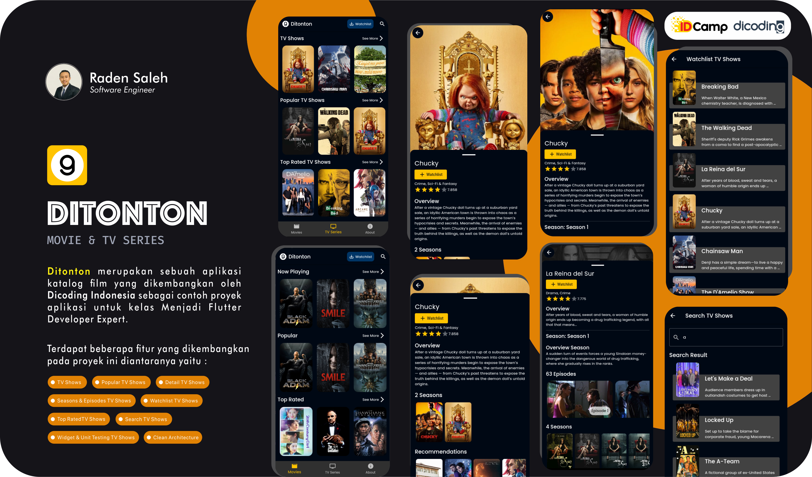

## Ditonton App


[](https://codemagic.io/apps/637db30d143bfdef85ed5ff6/637db30d143bfdef85ed5ff5/latest_build)
[](https://github.com/radensaleh/Ditonton-App/blob/master/LICENSE)
[](https://flutter.dev/)
[](https://github.com/radensaleh/Ditonton-App)

## Features
*  Movies (Now Playing, Popular, Top Rated)
*  TV Show (On The Air, Popular, Top Rated)
*  Watchlist Movies & TV Show
*  Search Movies & TV Shows
*  Detail Movies & TV Show
*  Detail Season & Episode TV Show

## Banner Design
<pre>

</pre>

## Quick start
This is a normal flutter app. You should follow the instructions in the [official documentation](https://flutter.io/docs/get-started/install).
This project uses **BLoC** (business logic component) to separate the business logic with UI itself.
It's recommended to do self-study about it before jumping into the project [here](https://bloclibrary.dev/).
And also on this project uses **Modularization** approach to separate each feature ([core](https://github.com/radensaleh/Ditonton-App/tree/master/modules/core), [feature_about](https://github.com/radensaleh/Ditonton-App/tree/master/modules/feature_about), [feature_movie](https://github.com/radensaleh/Ditonton-App/tree/master/modules/feature_movie), [feature_tv](https://github.com/radensaleh/Ditonton-App/tree/master/modules/feature_tv) modules).

## Modularization Structure 🔥

    # Root Project
    .
    |
    ├── lib                        # Name of module (default from Flutter).
    │
    └── modules                    # Name of directory.
        ├── core                   # Name of module.
        │   ├── database           # Business logic component.
        │   ├── styles             # Color, Text & Theme Styles.
        │   ├── utils              # Util shared.
        │   └── presentation       # UI, Widget, State Management.
        │   
        ├── feature_about          # Name of module.
        │   └── presentation       # UI, Widget, State Management.
        │
        ├── feature_movie          # Name of module.
        │   ├── data               # Local & Remote data, Model, Repository.
        │   ├── domain             # Business logic component (Entities, Usecases).
        │   └── presentation       # UI, Widget, State Management.
        │
        └── feature_tv             # Name of module.
            ├── data               # Local & Remote data, Model, Repository.
            ├── domain             # Business logic component (Entities, Usecases).
            └── presentation       # UI, Widget, State Management.


## Built With 🛠
* [BLoC Pattern](https://bloclibrary.dev/) - Business logic component to separate the business logic with UI.
* [SQLite](https://pub.dev/packages/sqflite) - Local Database
* [Equatable](https://pub.dev/packages/equatable) - Being able to compare objects in `Dart` often involves having to override the `==` operator.
* [Json Serializable](https://pub.dev/packages/json_serializable) - Builders for handling JSON.
* [Shared Preferences](https://pub.dev/packages/shared_preferences) - Cache implementation approach.
* [Modularization](https://medium.com/flutter-community/mastering-flutter-modularization-in-several-ways-f5bced19101a) - Separate functionality into independent, interchangeable modules.
* [Codemagic](https://blog.codemagic.io/environments-in-flutter-with-codemagic-cicd/) - Handling DevOps CI/CD for pipeline and automatically build.
* Handle State - (Loading, No Data, Has Data, Error)
* [Get It](https://pub.dev/packages/get_it) - A Dependency Injection

## Author

* **Raden Saleh**

Don't forget to follow me, fork and give me a ⭐


## License

```
MIT License

Copyright (c) 2022 Raden Saleh

Permission is hereby granted, free of charge, to any person obtaining a copy
of this software and associated documentation files (the "Software"), to deal
in the Software without restriction, including without limitation the rights
to use, copy, modify, merge, publish, distribute, sublicense, and/or sell
copies of the Software, and to permit persons to whom the Software is
furnished to do so, subject to the following conditions:

The above copyright notice and this permission notice shall be included in all
copies or substantial portions of the Software.

THE SOFTWARE IS PROVIDED "AS IS", WITHOUT WARRANTY OF ANY KIND, EXPRESS OR
IMPLIED, INCLUDING BUT NOT LIMITED TO THE WARRANTIES OF MERCHANTABILITY,
FITNESS FOR A PARTICULAR PURPOSE AND NONINFRINGEMENT. IN NO EVENT SHALL THE
AUTHORS OR COPYRIGHT HOLDERS BE LIABLE FOR ANY CLAIM, DAMAGES OR OTHER
LIABILITY, WHETHER IN AN ACTION OF CONTRACT, TORT OR OTHERWISE, ARISING FROM,
OUT OF OR IN CONNECTION WITH THE SOFTWARE OR THE USE OR OTHER DEALINGS IN THE
SOFTWARE.
```